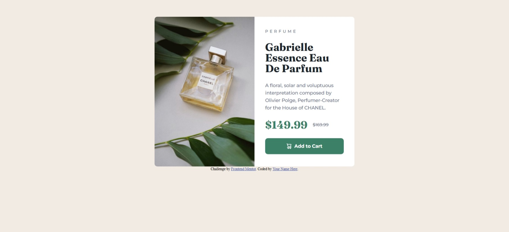
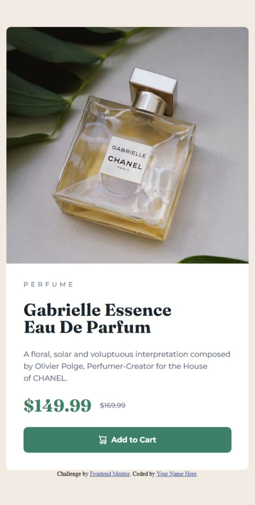

# Frontend Mentor - Product preview card component solution

This is a solution to the [Product preview card component challenge on Frontend Mentor](https://www.frontendmentor.io/challenges/product-preview-card-component-GO7UmttRfa). Frontend Mentor challenges help you improve your coding skills by building realistic projects. 

## Table of contents

- [Overview](#overview)
  - [The challenge](#the-challenge)
  - [Screenshot](#screenshot)
  - [Links](#links)
- [My process](#my-process)
  - [Built with](#built-with)
  - [What I learned](#what-i-learned)
  - [Continued development](#continued-development)
  - [Useful resources](#useful-resources)
  - [AI Collaboration](#ai-collaboration)
- [Author](#author)
- [Acknowledgments](#acknowledgments)


## Overview

### The challenge

Users should be able to:

- View the optimal layout depending on their device's screen size
- See hover and focus states for interactive elements

### Screenshot





### Links

- Solution URL: [My solution URL here](https://github.com/polo372/product-preview-card-component-main)
- Live Site URL: [My live site URL here](https://productviewfme.netlify.app/)

## My process

### Built with

- Semantic HTML5 markup
- CSS custom properties
- Flexbox
- Mobile-first workflow

### What I learned

I use the class name to apply font style

```html
      <p class="price"><span class="sell-price fraunces text-preset1">$149.99</span><span class="sold-price montserrat text-preset5">$169.99</span></p>

```
The img was declared in the css to stay adapt to the screen width.

```css
    figure{
    content: url(/images/image-product-desktop.jpg);
    }
```

### Continued development

I am not really satisfy about the body alignment, i will continue to work on this 

### Useful resources

- [The kevin powell courses's](https://courses.kevinpowell.co/conquering-responsive-layouts) - I follow this courses to know better the responsive design

### AI Collaboration

I use claude to add the image in the figure and my main element and apply them the border-radius. He help me to think about this problem and find by my-self the solution

## Author

- Website - [My Github](https://github.com/polo372)
- Frontend Mentor - [@ypolo372](https://www.frontendmentor.io/profile/polo372)
- Twitter - [@plbd372](https://x.com/plbd372)


